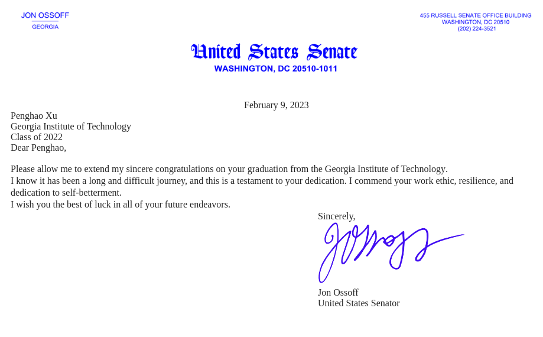

I completed my thesis "_Revealing patterns of ribonucleotide incorporation in genomic DNA of eukaryotic cells_"  and got my Ph.D. degree in Bioinformatics at Georgia Tech. Ph.D. program is a long journey and I've received plenty of help during the five years. Thanks my advisor __Dr. Francesca Storici__ for all her guidance and my committee members __Dr. Mark Borodovsky__, __Dr. Shamkant Navathe__, __Dr. Patrick McGrath__, and __Dr. Fredrik Vannberg__ for all their support! After graduation, I'll continue my research in Storici Lab as a postdoc. Hope I can do some better research on rNMP incorporation in DNA!

I also got a Congratulation letter from U.S. Senator __Jon Ossoff__ !!! :satisfied:

